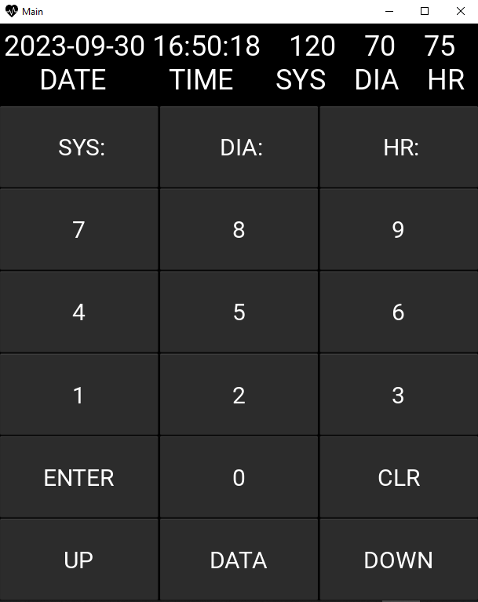

# Kanka-goswami_Vital-Statistics-Recorder
**Hobby project in Python:** This application allows the user to save and record the measured Systolic (SYS), Diastolic (DIA) and heart rate (HR) values using a Sphygmomanometer (Blood pressure machine). It is aimed to track the historical Vital Statistics of the user.

This hobby project began with an aim to keep up with the changing vitals of my parents. The application accepts and retrieves data and stores it in a database format.

## Features of the application
The interface and design of the Vital Statistics Recorder aim to be simplistic and minimal. The targeted uses require a very low tech-savvy skill.
The layout is designed based on a calculator interface, which is simplistic and intuitive for the user.
The application is designed to be very lightweight and take up minimalistic space to run on a basic mobile phone.

- Single-page app to avoid any complicated browsing.
- Calculator layout.
- Screen clearing button.
- ENTER button for saving the data.
- DATA, UP and DOWN buttons for data retrieval and scrolling the database.
- Provides automatic timestamp while saving the data.
